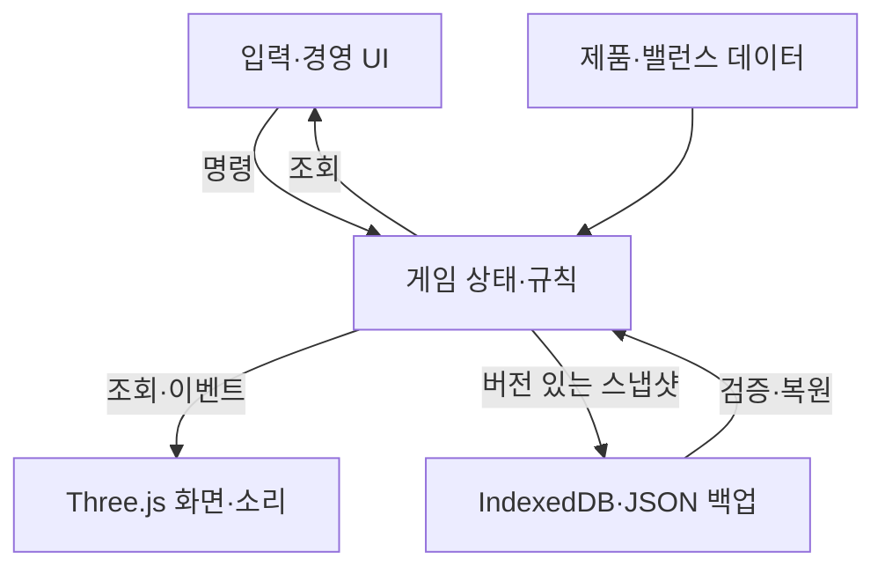

# 런타임 아키텍처

상태: G001 공간·입력·고정 스텝 구현. 고객·경제·세이브 부분은 구현 전 설계입니다. 기본 선택은 [기존 계획](../product/plan.md)에서 가져왔습니다. 아래 수치와 타입 이름은 첫 구현에서 검증할 계약입니다.

## 1. 구조

TypeScript 단일 애플리케이션을 기능별 모듈로 나눕니다. Three.js(WebGL2)는 장면·카메라를, React DOM은 경영 화면을 담당합니다. Vite로 정적 빌드합니다. 초기부터 별도 백엔드, 범용 ECS, 플러그인 엔진 또는 마이크로서비스를 만들지 않습니다.

## 2. 실제 코드가 생길 때의 디렉터리

| 예정 경로 | 책임 | 의존성 제한 |
| --- | --- | --- |
| `src/sim/` | 고객·좌석·주문·직원·경제·게임 시간·직렬화 상태 | Three/React/DOM/IndexedDB 직접 접근 금지 |
| `src/content/` | 제품·게임·메뉴·고객 성향의 검증된 데이터 | 런타임 에셋 경로 대신 안정적인 ID 연결 |
| `src/runtime/` | 고정 스텝, 입력 모드, 서비스 연결 | sim의 명령 API 사용 |
| `src/render/` | 장면·카메라·애니메이션·조명·자산 수명 | 규칙 변경 금지 |
| `src/ui/` | HUD·카운터·배치·설정·보고서 | 조회와 명령. 프레임마다 React 전체 갱신 금지 |
| `src/platform/` | 저장·가져오기·브라우저 생명주기 | 복원 전에 스키마 검증 |
| `public/assets/` | 웹 배포용 GLB·텍스처·소리·디코더 | 원본 `.blend`를 직접 넣지 않음 |
| `tests/` | 규칙·시나리오·브라우저 핵심 흐름 | 실제 사용자 결과 중심 |

G001은 sim/content/runtime/render/ui 경로를 실제 사용합니다. platform은 저장 기능을 구현할 때 생성합니다. 인터페이스의 이름보다 소유권 경계를 유지하는 것이 목적입니다.

## 3. 상태·명령·이벤트

`GameState`는 버전, seed/난수 상태, tick, 사업 시각, 매장 배치, 고객, 좌석, 이용 세션, 음식 주문, 직원, 현금·선불잔액·매출 원장, 제품 설치 상태를 소유합니다. Three Mesh, DOM, 함수, Promise, 파일 URL은 저장하지 않습니다.

| 명령 예 | 규칙 검증 | 결과 예 |
| --- | --- | --- |
| `OpenCafe` | 설치와 기본 통로 조건 | 영업 상태 변경 |
| `AssignSeat` | 고객/그룹 중복 예약, 사용 가능 좌석 | 좌석 예약과 고객 상태를 한 번에 반영 |
| `PurchaseUpgrade` | 가격 버전, 잔액, 호환성, 설치 가능 위치 | 한 번의 지출·장비 상태 변경 |
| `ClaimOrder` | 주문 진행 상태, 담당자 유효성 | 사장 또는 직원 한 명에게 업무 배정 |
| `CompleteOrder` | 현재 담당자와 준비/전달 상태 | 단 한 번의 판매 완료 |
| `ChangeLayout` | 점유·예약 좌석, 통로, 설비 충돌 | 배치 개정 번호 증가, 경로 재계산 |

명령에는 식별자와 적용 tick을 두어 중복 입력을 판별합니다. 저장에서 미결 거래를 복원할 때도 중복 반영을 막습니다. 영구 이벤트 소싱 서버를 만들지는 않습니다. 이벤트는 UI·소리·개발 로그에 필요한 사실만 전달합니다. 예: `CustomerLeft(reason=group_seats_unavailable)`은 실제 이탈 계산에서 나와야 합니다.

## 4. 시간·배속·이동

첫 가정은 **시뮬레이션 시간 50ms 고정 스텝**입니다. 렌더링 프레임과 분리하며 1배속은 실제 시간만큼, 2·4배속은 해당 배수의 sim 시간을 누적합니다. 사업 달력은 sim 시간에 별도 변환 계수를 적용합니다. 하루 20분을 시험하면 사업 시각은 sim 1초당 72초 진행합니다. 계수는 밸런스 데이터에 둡니다.

이동과 짧은 작업은 sim 초로, 임대료·이용요금 등 달력 기반 규칙은 사업 시각으로 처리합니다. 변환은 한 곳에서만 합니다. 고객의 기본 이동이 달력 압축 때문에 비정상적으로 빨라지지 않게 합니다. 배속은 같은 sim 스텝을 더 실행하며 동일한 tick의 명령 기록을 재생하면 같은 사업 결과가 나와야 합니다.

누적 스텝은 예산 내에서 처리하고 과부하 시 simulation lag를 표시합니다. 경제 시간을 건너뛰거나 한번에 큰 delta로 바꿔 돈·주문을 누락하지 않습니다. 탭이 숨겨지거나 일시정지·배치 모드이면 누적 시간을 초기화하고 멈춥니다. 첫 버전은 오프라인 수익을 계산하지 않습니다.

고객의 좌석 탐색·새 경로 선택은 상태 변경 또는 분산된 주기로 수행합니다. 이동은 고정 스텝, 화면 자세는 보간합니다. WebGL 화면 밖에서도 영업 상태는 동일하게 진행합니다. UI 모달을 열면 포인터 잠금을 해제하고 게임 입력을 분리합니다.

## 5. 공간·길찾기·물리

1단위=1m, 런타임 Y-up을 기본으로 합니다. Blender 좌표 변환은 glTF 내보내기에서 처리합니다. 길찾기는 작은 매장에 맞는 그리드와 좌석 접근 지점으로 시작합니다. G001 플레이어 충돌은 Rapier capsule character controller와 고정 cuboid를 사용하며 물건마다 정교한 강체 시뮬레이션을 넣지 않습니다.

좌석에는 배치 지점, 착석 지점, 접근 지점, 방향, 접근 가능한 구역이 필요합니다. 고객은 도착한 뒤 앉는 상태로 전환합니다. 앉은 인물이 의자와 맞는지는 별도 시각 검증 대상입니다. Rapier가 길찾기나 경제의 기준이 되게 하지 않습니다. 리플레이 목표는 사업 규칙과 명령 기록이며 물리 엔진의 모든 브라우저 간 비트 단위 일치는 약속하지 않습니다.

배치 모드는 일시정지합니다. 사용 중·예약 중 좌석은 이동 불가로 시작합니다. 통로를 막는 배치는 확정 전에 이유를 표시합니다. 배치 개정이 바뀌면 고객·직원의 관련 경로를 무효화합니다.

## 6. 핵심 상태 전이

- 고객: 도착 → 대기/예약 → 이동 → 이용 → 정리 대기 없이 퇴장. 이용 종료 시 좌석은 비점유·청소 필요 상태로 분리합니다.
- 주문: 접수 → 조리 → 준비 → 전달 중 → 완료 또는 취소. 업무 claim은 상태와 담당자 ID로 관리합니다.
- 직원: 대기 → 업무 선택 → 이동 → 수행 → 완료. 해고·경로 실패는 claim을 반환하고 재선택합니다.
- PC: 정상/고장, 설치 제품, 가용 게임, 오염도. 구매 가격이 높다는 이유만으로 고객 만족을 고정 상승시키지 않습니다.

플레이어와 직원은 같은 업무 명령을 사용합니다. UI 버튼 비활성화는 보조 수단이며 중복 주문·지출은 sim에서 막습니다.

## 7. 돈과 요금

금액은 정수 원으로 관리하고 소수 누적분의 정산 규칙을 한 곳에 둡니다. 현금 유입과 이용 매출을 구별합니다. 선불 충전은 현금 증가와 미사용 잔액 증가, 실제 이용은 잔액 감소와 이용 매출 증가입니다. 같은 충전액을 충전 시점과 사용 시점에 모두 매출로 더하지 않습니다. 음식은 이번 게임의 명시적 결제 정책에 따라 한 번만 정산합니다.

G002의 초기 이용은 단순 종료 결제로 시작할 수 있습니다. 선불·시간권이 추가되는 G008에서 원장·보고서·저장 형식을 함께 검증합니다. 임대료·급여·전력 등은 예정 지출과 실제 지출 시점을 보여줍니다. 현실의 세무 시스템 전체를 구현하지 않습니다.

## 8. 저장과 버전

첫 영업 루프가 생기면 IndexedDB에 자동저장 슬롯, 마지막 정상 백업, 수동 JSON 내보내기를 제공합니다. 새 스냅샷의 검증이 끝난 뒤 저장하며 기존 정상 저장을 오류 응답으로 덮어쓰지 않습니다. ID 참조 무결성, 음수 재고, 중복 점유, 숫자 범위를 확인합니다.

저장에는 `saveVersion`, `contentVersion`, `balanceVersion`, RNG 상태, 게임 상태를 기록합니다. 런타임 자산은 안정적인 ID로 다시 연결합니다. 다른 에셋 파일명으로 교체해도 저장이 깨지지 않아야 합니다. 모르는 미래 버전은 설명과 백업 기회를 제공하고 실패합니다. 마이그레이션은 원본 백업 후 적용합니다.

IndexedDB는 URL 경로가 아닌 origin(프로토콜·호스트·포트)을 기준으로 구분됩니다. 같은 origin의 다른 저장소 사이트와 이름이 충돌하지 않도록 게임 전용 DB 이름을 사용합니다. 도메인·프로토콜·포트가 바뀌면 기존 저장에 직접 접근할 수 없으므로 JSON 백업·가져오기를 제공합니다. 동시 탭은 세이브 충돌을 막기 위해 한 탭만 쓰도록 구현하고 다른 탭은 읽기 제한 또는 명시적 새 세션으로 처리합니다. [MDN IndexedDB 기본 개념](https://developer.mozilla.org/en-US/docs/Web/API/IndexedDB_API/Basic_Terminology)

## 9. 디버그와 측정

개발 패널은 seed·tick·가동석·고객/주문 상태·시뮬레이션 지연·draw calls·삼각형·로딩 오류를 표시합니다. 개발 전용 시나리오로 같은 피크 장면을 불러옵니다. UI 자동 검증에서는 테스트용 명령/조회 통로를 사용할 수 있으나 실제 UI를 거치는 핵심 흐름도 반드시 둡니다.

WebGPU, worker, 더 정교한 길찾기, ECS는 측정 결과 현재 방식이 병목일 때 검토합니다. 성능 개선으로 돈·고객 수·수요를 몰래 줄이지 않습니다.

## G001에서 실제 적용한 경계

- 사업 상태는 불변 스냅샷과 command/step으로만 변경합니다. 지금은 tick과 선택 좌석만 존재합니다. ESLint가 sim의 Three/React/DOM 의존을 막습니다.
- 사장 카메라와 Rapier 이동은 runtime의 로컬 탐색 상태이며 사업 저장에 포함하지 않습니다. 향후 위치 저장이 필요하면 명시적으로 스냅샷에 추가합니다.
- 고정 스텝은 프레임당 최대 8번 처리하고 초과분은 lag로 유지합니다. 모달·숨김·배치·복귀 시 누적 시간을 버려 오프라인 진행을 막습니다.
- UI는 최대 4Hz 진단 스냅샷과 실제 전환에서 갱신하며 매 렌더 프레임을 React 상태로 보내지 않습니다.
- 배치 규칙은 src/sim/layout.ts의 미리보기 검증뿐입니다. 확정, 회전, 통로 연결성, 고객 경로는 아직 없습니다.

G001의 플레이어 이동과 방향키 시선도 고정 50ms 스텝에서 처리합니다. 화면 위치는 완만하게 보간합니다. 정적 장면의 그림자 맵은 필요할 때만 갱신합니다. G002에서 움직이는 손님을 추가할 때 shadow.needsUpdate 또는 동적 갱신 정책도 함께 연결해야 합니다.

## G002: 고객·매출 연결

GameState version 2에 영업 여부·고객 목록·좌석 소유자·현금·누적 결제 인원·최근 30건 영수증을 추가했습니다. 저장 구현 전의 상태 버전이며 기존 저장 파일 마이그레이션을 구현한 것은 아닙니다. 좌석 예약은 arrive 명령에서 원자적으로 수행하고 finish-session은 이용 중이며 종료 tick에 도달한 고객만 처리합니다. 고객이 퇴장하면 활성 목록에서 제거합니다.

정적 가구 주변 0.25m 격자를 BFS로 탐색하고 직선 구간을 압축합니다. 입장 시 왕복 경로를 계산합니다. 현재 배치 확정이 없으므로 이동 중 동적 레이아웃 변화는 없습니다. walking 경로가 없으면 예약을 반환하고 결제 없이 방문을 종료합니다. NPC 간 회피와 사장과 NPC의 물리 충돌은 후속 과제입니다.

사업 clock은 선택한 1/4배속, 사장 이동 clock은 1배속입니다. 두 clock은 모달·배치·숨김에서 정지합니다. 렌더는 고객 상태를 읽어 보간하며, 고객이 있거나 마지막 고객을 제거한 프레임에서 그림자를 갱신합니다. 자산 품질 옵션은 수요·이용·금액을 바꾸지 않습니다.
